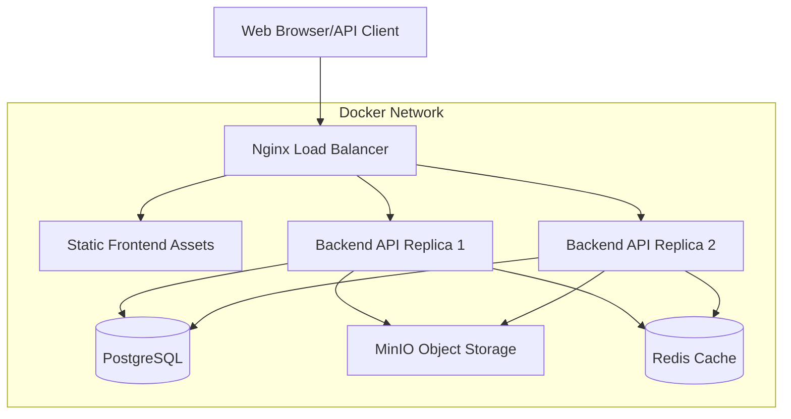
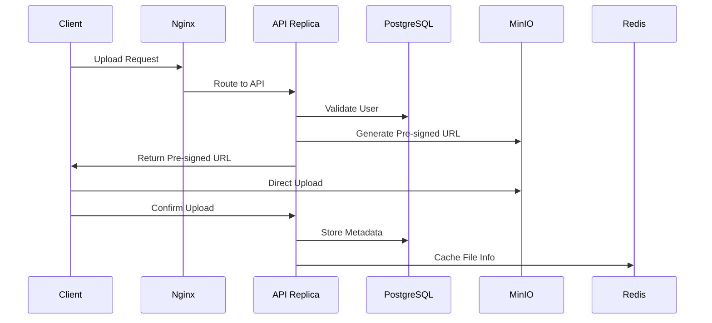

# Design Document

## Overview

FileBox is designed as a cloud-native, stateless file sharing application optimized for Docker deployment. The architecture follows microservices principles with clear separation of concerns, horizontal scalability, and production-ready observability features. The system uses a multi-tier architecture with Nginx as the entry point, multiple backend API replicas for high availability, and dedicated services for data persistence and object storage.

## Architecture

### High-Level Architecture



### Service Communication Flow



## Components and Interfaces

### 1. Nginx Load Balancer

**Purpose:** Entry point for all traffic, static asset serving, and load balancing

**Configuration:**
- **Port:** 80 (exposed as 8080 on host)
- **Upstream:** Round-robin between api1:8080 and api2:8080
- **Static Assets:** Serves React SPA from `/usr/share/nginx/html`
- **API Routing:** Proxies `/api/*` requests to backend replicas

**Key Features:**
- Health check integration with backend services
- WebSocket pass-through support for future real-time features
- Rate limiting for authentication and share endpoints
- Request logging with correlation IDs

**Dockerfile Strategy:**
- Multi-stage build: Node.js for frontend compilation, Nginx for serving
- Custom nginx.conf with upstream configuration
- Frontend assets built during Docker image creation

### 2. Backend API Service

**Purpose:** Stateless REST API handling authentication, file metadata, and pre-signed URL generation

**Technology Stack:**
- **Framework:** Gin (Go HTTP framework)
- **Authentication:** JWT with HS256 signing
- **Password Hashing:** bcrypt with configurable cost
- **Database:** PostgreSQL with database/sql driver
- **Object Storage:** MinIO Go SDK
- **Caching:** Redis Go client

**API Endpoints:**
```
POST /register          - User registration
POST /login            - User authentication
POST /files/presign    - Generate upload pre-signed URL
POST /files            - Store file metadata
GET  /files            - List user files
POST /shares/:id       - Create share link
GET  /shares/:token    - Download via share link
GET  /healthz          - Health check
GET  /metrics          - Prometheus metrics
```

**Stateless Design:**
- No server-side session storage
- JWT tokens contain all necessary user context
- Database connections are stateless and pooled
- Redis used only for caching, not session state

**Scaling Configuration:**
- Multiple replicas (api1, api2) with identical configuration
- Shared database and Redis instances
- Environment-based configuration for service discovery

### 3. PostgreSQL Database

**Purpose:** Persistent storage for user accounts, file metadata, and share tokens

**Schema Design:**
```sql
-- Users table with email-based authentication
CREATE TABLE users (
    id SERIAL PRIMARY KEY,
    email TEXT UNIQUE NOT NULL,
    password TEXT NOT NULL,
    created_at TIMESTAMPTZ DEFAULT NOW()
);

-- Files table with user ownership and metadata
CREATE TABLE files (
    id SERIAL PRIMARY KEY,
    user_id INT REFERENCES users(id) ON DELETE CASCADE,
    name TEXT NOT NULL,
    size BIGINT,
    content_type TEXT,
    tags TEXT[],
    created_at TIMESTAMPTZ DEFAULT NOW(),
    updated_at TIMESTAMPTZ DEFAULT NOW()
);

-- Share tokens with expiration
CREATE TABLE shares (
    id SERIAL PRIMARY KEY,
    file_id INT REFERENCES files(id) ON DELETE CASCADE,
    token TEXT UNIQUE NOT NULL,
    expires TIMESTAMPTZ NOT NULL,
    created_at TIMESTAMPTZ DEFAULT NOW()
);

-- Activity log for audit trail
CREATE TABLE activities (
    id SERIAL PRIMARY KEY,
    user_id INT REFERENCES users(id),
    action TEXT NOT NULL,
    resource_type TEXT,
    resource_id INT,
    metadata JSONB,
    created_at TIMESTAMPTZ DEFAULT NOW()
);

-- Indexes for performance
CREATE INDEX idx_files_user_id ON files(user_id);
CREATE INDEX idx_files_tags ON files USING GIN(tags);
CREATE INDEX idx_shares_token ON shares(token);
CREATE INDEX idx_shares_expires ON shares(expires);
CREATE INDEX idx_activities_user_id ON activities(user_id);
```

**Configuration:**
- **Image:** postgres:16-alpine
- **Connection Pooling:** Handled by application layer
- **Persistence:** Docker volume `db_data`
- **Security:** Environment-based credentials

### 4. MinIO Object Storage

**Purpose:** S3-compatible object storage for file content

**Configuration:**
- **Image:** minio/minio
- **Ports:** 9000 (API), 9001 (Console)
- **Storage:** Docker volume `minio_data`
- **Bucket Policy:** Private with pre-signed URL access only

**Security Model:**
- Pre-signed URLs for upload/download operations
- 10-minute expiration for all pre-signed URLs
- Content-type and size validation before URL generation
- No public bucket access or listing

**Integration:**
- Go SDK for pre-signed URL generation
- Direct client-to-MinIO uploads to reduce API server load
- Automatic bucket creation on startup

### 5. Redis Cache

**Purpose:** High-performance caching for share token lookups and rate limiting

**Configuration:**
- **Image:** redis:7-alpine
- **Persistence:** Optional (cache-only usage)
- **Connection:** Single instance shared by all API replicas

**Usage Patterns:**
- **Share Token Caching:** Cache file names by share token to avoid database lookups
- **Rate Limiting:** Distributed counters for API endpoint rate limiting
- **TTL Management:** Automatic expiration aligned with share token lifetimes

### 6. Frontend Application

**Purpose:** React-based single-page application for user interface

**Technology Stack:**
- **Framework:** React 18 with functional components
- **Build Tool:** Vite for fast development and optimized builds
- **Package Manager:** pnpm for efficient dependency management
- **Styling:** Modern CSS with accessibility considerations

**Key Features:**
- JWT token management with automatic refresh
- File upload with progress indicators
- Drag-and-drop file interface
- Responsive design for mobile and desktop
- WCAG 2.1 AA compliance for accessibility

**Build Process:**
- Multi-stage Docker build with Node.js compilation
- Production-optimized bundle with code splitting
- Static asset serving through Nginx

## Data Models

### User Model
```go
type User struct {
    ID        int       `json:"id" db:"id"`
    Email     string    `json:"email" db:"email"`
    Password  string    `json:"-" db:"password"`
    CreatedAt time.Time `json:"created_at" db:"created_at"`
}
```

### File Model
```go
type File struct {
    ID          int       `json:"id" db:"id"`
    UserID      int       `json:"user_id" db:"user_id"`
    Name        string    `json:"name" db:"name"`
    Size        int64     `json:"size" db:"size"`
    ContentType string    `json:"content_type" db:"content_type"`
    Tags        []string  `json:"tags" db:"tags"`
    CreatedAt   time.Time `json:"created_at" db:"created_at"`
    UpdatedAt   time.Time `json:"updated_at" db:"updated_at"`
}
```

### Share Model
```go
type Share struct {
    ID        int       `json:"id" db:"id"`
    FileID    int       `json:"file_id" db:"file_id"`
    Token     string    `json:"token" db:"token"`
    Expires   time.Time `json:"expires" db:"expires"`
    CreatedAt time.Time `json:"created_at" db:"created_at"`
}
```

### JWT Claims
```go
type JWTClaims struct {
    UserID int   `json:"sub"`
    Exp    int64 `json:"exp"`
    jwt.RegisteredClaims
}
```

## Error Handling

### Error Response Format
```json
{
    "error": "descriptive_error_message",
    "code": "ERROR_CODE",
    "request_id": "uuid-correlation-id",
    "timestamp": "2024-01-01T00:00:00Z"
}
```

### Error Categories

**Authentication Errors (401):**
- Invalid JWT token
- Expired token
- Missing authorization header

**Authorization Errors (403):**
- Insufficient permissions
- File ownership violations

**Validation Errors (400):**
- Invalid request format
- Missing required fields
- File size/type restrictions

**Not Found Errors (404):**
- File not found
- Share token expired/invalid
- User not found

**Rate Limiting (429):**
- Too many authentication attempts
- Share endpoint abuse
- General API rate limiting

**Server Errors (500):**
- Database connection failures
- MinIO service unavailable
- Redis cache errors

### Error Logging Strategy
- Structured JSON logs with correlation IDs
- Error severity levels (ERROR, WARN, INFO, DEBUG)
- Sensitive data redaction in logs
- Centralized error handling middleware

## Testing Strategy

### Unit Testing
- **Backend:** Go testing framework with table-driven tests
- **Database:** In-memory SQLite for isolated tests
- **Mocking:** Testify/mock for external service dependencies
- **Coverage Target:** >80% code coverage

### Integration Testing
- **API Testing:** HTTP client tests against running services
- **Database Testing:** PostgreSQL test containers
- **MinIO Testing:** Local MinIO instance for object operations
- **Redis Testing:** Redis test containers for cache operations

### End-to-End Testing
- **Docker Compose:** Full stack testing with test containers
- **User Flows:** Registration → Login → Upload → Share → Download
- **Load Balancing:** Verify requests distribute across replicas
- **Failover Testing:** Kill one replica and verify continued operation

### Performance Testing
- **Load Testing:** Artillery.js or similar for API endpoints
- **Metrics Collection:** Prometheus metrics during load tests
- **Response Time Validation:** P50 < 50ms, P95 < 200ms targets
- **Concurrent User Testing:** Multiple users with shared resources

### Security Testing
- **Authentication:** JWT token validation and expiration
- **Authorization:** User isolation and file ownership
- **Input Validation:** SQL injection and XSS prevention
- **Rate Limiting:** Verify rate limit enforcement

### Accessibility Testing
- **Automated:** axe-core integration in frontend tests
- **Manual:** Keyboard navigation and screen reader testing
- **WCAG Compliance:** 2.1 AA standard verification

## Deployment Configuration

### Environment Variables
```bash
# Database Configuration
POSTGRES_USER=filebox_user
POSTGRES_PASSWORD=secure_password
POSTGRES_DB=filebox
DATABASE_URL=postgres://filebox_user:secure_password@db:5432/filebox?sslmode=disable

# MinIO Configuration
MINIO_ENDPOINT=minio:9000
MINIO_ACCESS_KEY=filebox_access
MINIO_SECRET_KEY=secure_minio_secret
MINIO_BUCKET=filebox-files
MINIO_ROOT_USER=filebox_access
MINIO_ROOT_PASSWORD=secure_minio_secret

# JWT Configuration
JWT_SECRET=very_secure_jwt_secret_key_minimum_32_chars

# Redis Configuration
REDIS_ADDR=redis:6379
REDIS_PASSWORD=

# Application Configuration
LOG_LEVEL=info
METRICS_ENABLED=true
RATE_LIMIT_ENABLED=true
```

### Docker Compose Enhancements
- Health checks for all services
- Restart policies for production resilience
- Resource limits and reservations
- Network isolation and security
- Volume management for data persistence

### Monitoring and Observability
- Prometheus metrics endpoint on each service
- Structured JSON logging with correlation IDs
- Health check endpoints for load balancer integration
- Performance metrics collection and alerting